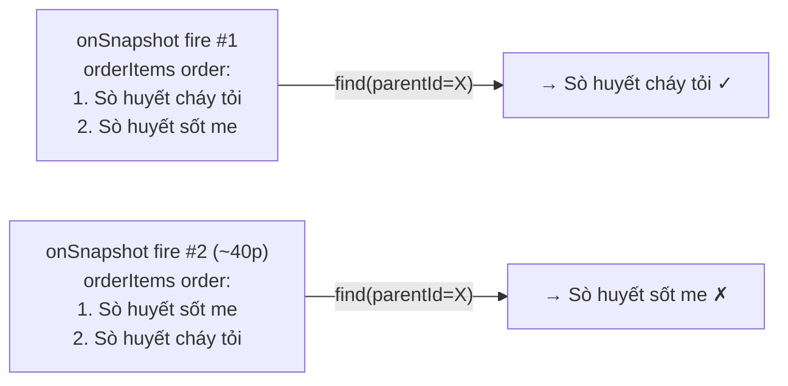

# Fix 2 Bugs: BillManagement Financial & KitchenManagement Name Switch

## Bug 1 — Lợi nhuận + Vốn + Chi phí cố định ≠ Doanh thu

### Root Cause

Hàm `getTotalSummary()` trong `[BillManagement.jsx](f:\QuanOc\ManageBill\src\pages\BillManagement.jsx)` (dòng 289–302) chỉ tính `totalCostPrice` và `totalFixedCost` cho items có `item.menuItemId`:

```js
// Dòng 294 — bỏ qua toàn bộ item.orderItemId
if (item.menuItemId) {
  const menuItem = menuItems.find(m => m.id === item.menuItemId);
  totalCostPrice += (menuItem.costPrice || 0) * item.quantity;
  totalFixedCost += (menuItem.fixedCost || 0) * item.quantity;
}
```

Bills mới dùng `item.orderItemId` (không có `menuItemId`), nên cả 2 field này bị tính = 0 → hiển thị lệch so với `totalRevenue`.

### Fix

- Load `orderItems` vào state trong `BillManagement` (dùng `onSnapshot` tương tự `menuItems` đã có sẵn trong AppContext — hoặc expose qua AppContext).
- Cập nhật `getTotalSummary()` để xử lý thêm `item.orderItemId`:
  - Lookup `orderItem` từ state → lấy `orderItem.parentMenuItemId`
  - Lookup `menuItem` từ `parentMenuItemId` → lấy `costPrice`, `fixedCost`

```js
// Thêm nhánh cho orderItemId
if (item.orderItemId) {
  const orderItem = orderItems.find(oi => oi.id === item.orderItemId);
  const menuItem = orderItem?.parentMenuItemId
    ? menuItems.find(m => m.id === orderItem.parentMenuItemId)
    : null;
  if (menuItem) {
    totalCostPrice += (menuItem.costPrice || 0) * item.quantity;
    totalFixedCost += (menuItem.fixedCost || 0) * item.quantity;
  }
}
```

---

## Bug 2 — Tên món đổi sau ~40-50 phút trong KitchenManagement

### Root Cause

Trong `[kitchenOptimizer.js](f:\QuanOc\ManageBill\src\utils\kitchenOptimizer.js)` (dòng 93–96), với bills cũ dùng `item.menuItemId`:

```js
// Fallback non-deterministic: find() trả item đầu tiên theo insertion order
orderItem = Array.from(orderItemsMap.values())
  .find(oi => oi.parentMenuItemId === item.menuItemId);
```

`onSnapshot` trên collection `orderItems` (không có `orderBy`) có thể trả documents theo thứ tự khác nhau mỗi khi re-fire (sau reconnect, sau khi document khác bị sửa, sau ~50 phút cache invalidation...). Khi thứ tự thay đổi, `find()` trả **child khác** của cùng parent → tên món đổi từ "Sò huyết cháy tỏi" sang "Sò huyết sốt me".




### Fix

- Trong `[useKitchenOrders.js](f:\QuanOc\ManageBill\src\hooks\useKitchenOrders.js)`: lấy `menuItems` từ `useApp()` (đã có sẵn) và truyền vào `calculateKitchenQueue`.
- Trong `calculateKitchenQueue`, thêm param `menuItems = []` và tạo `menuItemsMap`.
- Với items có `item.menuItemId`, dùng `menuItemsMap.get(item.menuItemId)?.name` thay vì `find()` qua orderItems:

```js
// kitchenOptimizer.js — thêm menuItems param
export const calculateKitchenQueue = (bills, menuTimings = [], orderItems = [], menuItems = []) => {
  const menuItemsMap = new Map();
  menuItems.forEach(mi => menuItemsMap.set(mi.id, mi));

  // ...trong flatMap...
  // Thay find() fallback bằng menuItemsMap lookup:
  const menuItemName = item.menuItemId
    ? menuItemsMap.get(item.menuItemId)?.name
    : null;
  // Dùng: orderItem?.name || menuItemName || item.name || timing?.name
```

---

## Files thay đổi

- `[src/pages/BillManagement.jsx](f:\QuanOc\ManageBill\src\pages\BillManagement.jsx)` — load `orderItems` state, fix `getTotalSummary()`
- `[src/utils/kitchenOptimizer.js](f:\QuanOc\ManageBill\src\utils\kitchenOptimizer.js)` — thêm `menuItems` param, thay `find()` bằng map lookup
- `[src/hooks/useKitchenOrders.js](f:\QuanOc\ManageBill\src\hooks\useKitchenOrders.js)` — truyền `menuItems` vào `calculateKitchenQueue`

