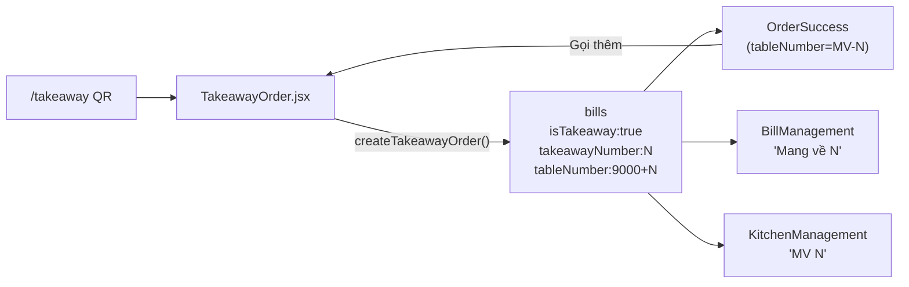

# Mang về + Sửa Chi tiết đơn hàng

## Kiến trúc luồng "Mang về"




**Key design decisions:**

- Mỗi lần submit tạo **bill mới** (không merge) — `tableNumber = 9000 + N` đảm bảo không đụng bàn thật (1-9)
- `takeawayNumber` = đếm `bills` hôm nay có `isTakeaway==true` + 1 (lưu trực tiếp vào bill)
- Không cần tách section riêng trong Kitchen — card hiện "MV N" thay vì "Bàn 9001"

---

## Files thay đổi

### 1. `[src/main.jsx](src/main.jsx)`

- Thêm route `/takeaway` vào `PublicRoutes`: `<Route path="/takeaway" element={<TakeawayOrder />} />`
- Cập nhật path check: `currentPath.startsWith('/takeaway')` vào điều kiện `PublicRoutes`

### 2. `src/pages/TakeawayOrder.jsx` (FILE MỚI)

- Clone logic `CustomerOrder.jsx`, bỏ `useParams` / `tableNumber`
- Header: "🥡 Mang về" thay vì "Bàn N", bỏ block "Đã gọi trước đó"
- Submit: gọi `createTakeawayOrder(items, revenue, profit, note)` → navigate `/order-success/MV-${n}`

### 3. `[src/utils/customerOrder.js](src/utils/customerOrder.js)`

Thêm function mới:

```js
export const createTakeawayOrder = async (items, totalRevenue, totalProfit, note = '') => {
  const today = new Date().toISOString().split('T')[0];
  const snap = await getDocs(query(
    collection(db, 'bills'),
    where('date', '==', today),
    where('isTakeaway', '==', true)
  ));
  const takeawayNumber = snap.size + 1;
  await addDoc(collection(db, 'bills'), {
    createdAt: serverTimestamp(), date: today,
    tableNumber: 9000 + takeawayNumber,
    status: 'pending', items, totalRevenue, totalProfit,
    isTakeaway: true, takeawayNumber,
    ...(note?.trim() ? { note: note.trim() } : {}),
  });
  await createMenuItemTimingsForNewItems(items).catch(() => {});
  return takeawayNumber;
};
```

### 4. `[src/pages/OrderSuccess.jsx](src/pages/OrderSuccess.jsx)`

Xử lý khi `tableNumber` bắt đầu bằng `"MV-"`:

- Tiêu đề: "Mang về N" thay vì "Bàn số N"
- "Gọi thêm món" → `/takeaway` (tạo đơn mới)
- "Xem hóa đơn" ẩn đi (không áp dụng cho mang về)

### 5. `[src/pages/BillManagement.jsx](src/pages/BillManagement.jsx)`

**a) Hiển thị tên "Mang về N"** — thêm helper và dùng ở mọi chỗ show tên đơn:

```js
const getBillLabel = (bill) =>
  bill.isTakeaway ? `Mang về ${bill.takeawayNumber}` : `Bàn ${bill.tableNumber}`;
```

**b) Sửa Chi tiết — case `orderItemId`** trong `handleViewDetails`:

```js
// Thay getDocs(collection(...)) bằng getDoc đúng ID
const orderItemDoc = await getDoc(doc(db, 'orderItems', item.orderItemId));
const orderItem = orderItemDoc.exists() ? { id: orderItemDoc.id, ...orderItemDoc.data() } : null;

// Hiển thị tên orderItem thay vì tên menuItem cha
if (orderItem) {
  const priceRef = parent || { price: orderItem.price ?? 0, tax: 0, costPrice: 0, fixedCost: 0 };
  return {
    ...item,
    menuItem: { ...priceRef, name: orderItem.name }, // ← name từ orderItem
    itemRevenue: priceRef.price * item.quantity,
    type: 'menu'
  };
}
```

### 6. `[src/components/KitchenManagement.jsx](src/components/KitchenManagement.jsx)`

Trong `tableCards` useMemo, thêm `displayName`:

```js
grouped[tn].displayName = bill?.isTakeaway
  ? `MV ${bill.takeawayNumber}`
  : `Bàn ${tn}`;
```

Truyền `displayName` vào `TableCard` và dùng ở header thay vì `Bàn {tableNumber}`.  
Link "Thêm" cho takeaway card trỏ tới `/takeaway`.